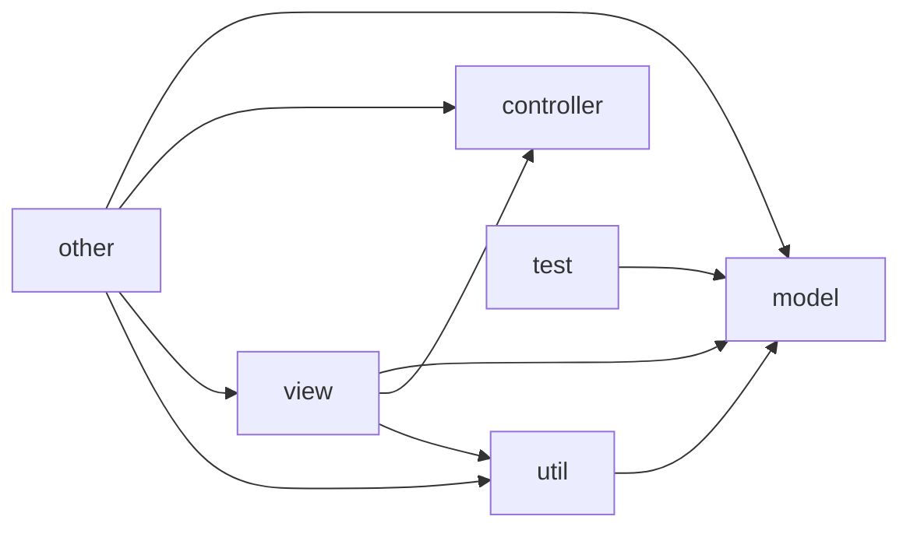

# 🗺️ Project Architecture Map

**Generated**: 2025-12-26 22:15
**Project**: c:\Auto\office_converter

## 📊 Summary

| Metric | Count |
|:---|---:|
| Total Modules | 80 |
| Total Dependencies | 547 |
| Total Lines | 26137 |

## 🏗️ Architecture Layers

### ⚙️ Controller (22 modules)

- `converters\__init__.py` (80 lines)
- `converters\base.py` (194 lines) - Classes: BaseConverter
- `converters\excel.py` (392 lines) - Classes: ExcelConverter
- `converters\libreoffice.py` (200 lines) - Classes: LibreOfficeConverter
- `converters\ppt.py` (136 lines) - Classes: PPTConverter
- `converters\word.py` (159 lines) - Classes: WordConverter
- `grid\__init__.py` (55 lines)
- `grid\circuit_breaker.py` (262 lines) - Classes: CircuitBreakerConfig, CircuitBreakerCoordinator
- `grid\grid.py` (405 lines) - Classes: ConversionGrid
- `grid\models.py` (273 lines) - Classes: FileType, Priority, ConversionFile
- ... and 12 more

### 📦 Model (3 modules)

- `core\excel_tools.py` (826 lines)
- `core\file_tools.py` (640 lines) - Classes: RenamePreview, RenameRule, CaseRule
- `core\pdf_tools.py` (933 lines)

### 📄 Other (14 modules)

- `__init__.py` (5 lines)
- `build_exe.py` (352 lines)
- `build_script.py` (129 lines)
- `deploy_automation.py` (166 lines)
- `deploy_simple.py` (92 lines)
- `main.py` (86 lines)
- `merge_project.py` (292 lines) - Classes: ProjectMerger
- `run_grid.py` (131 lines)
- `run_pro.py` (37 lines)
- `run_reactor.py` (35 lines)
- ... and 4 more

### 📜 Script (5 modules)

- `scripts\auto_commit.py` (89 lines)
- `scripts\auto_save.py` (70 lines)
- `scripts\benchmark.py` (86 lines)
- `scripts\check_code.py` (182 lines)
- `scripts\context_mapper.py` (391 lines) - Classes: ModuleInfo, DependencyGraph, ASTAnalyzer

### 🧪 Test (11 modules)

- `tests\conftest.py` (168 lines)
- `tests\test_bug_fixes.py` (130 lines) - Classes: TestParsePageRange, TestPdfToolsImports, TestMainWindowButtons
- `tests\test_core.py` (97 lines) - Classes: TestImports, TestConfig, TestPdfTools
- `tests\test_file_tools.py` (199 lines) - Classes: TestFileTools
- `tests\test_grid_core.py` (616 lines) - Classes: TestPriority, TestConversionFile, TestClusteredPriorityQueue
- `tests\test_grid_phase2.py` (390 lines) - Classes: TestCircuitBreakerCoordinator, TestWorkerPool, TestConversionGrid
- `tests\test_integration.py` (367 lines) - Classes: TestQueueIntegration, TestTemporaryFileFiltering, TestStateTransitions
- `tests\test_performance.py` (285 lines) - Classes: TestBackgroundPDFPreview, TestVirtualFileList, TestAppendOnlyLog
- `tests\test_property_based.py` (369 lines) - Classes: TestAdaptiveTimeoutProperties, TestMemoryThresholdProperties, TestBatchSplittingProperties
- `tests\test_resilience.py` (360 lines) - Classes: TestZombieProcessHandling, TestCOMCrashHandling, TestMemoryLeakDetection
- ... and 1 more

### 🔧 Util (15 modules)

- `utils\__init__.py` (16 lines)
- `utils\com_pool.py` (271 lines) - Classes: COMPool
- `utils\config.py` (115 lines) - Classes: Config
- `utils\dnd_helpers.py` (71 lines)
- `utils\history.py` (134 lines) - Classes: ConversionRecord, ConversionHistory
- `utils\localization.py` (524 lines)
- `utils\logging_setup.py` (65 lines)
- `utils\ocr.py` (368 lines)
- `utils\parallel_converter.py` (365 lines) - Classes: JobStatus, ConversionJob, ConversionResult
- `utils\pdf_tools.py` (71 lines)
- ... and 5 more

### 🖥️ View (10 modules)

- `ui\__init__.py` (4 lines)
- `ui\dialogs.py` (153 lines) - Classes: SettingsDialog
- `ui\excel_tools_ui.py` (867 lines) - Classes: ExcelToolsDialog
- `ui\file_tools_ui.py` (797 lines) - Classes: DuplicateResultWidget, RuleWidget, FileToolsDialog
- `ui\file_tools_ui_v2.py` (461 lines) - Classes: FileToolsDialogV2
- `ui\main_window.py` (1425 lines) - Classes: ConverterApp
- `ui\main_window_ctk.py` (977 lines) - Classes: AnimatedButton, FileTypeIndicator, ModernConverterApp
- `ui\main_window_pro.py` (2134 lines) - Classes: FileType, ConversionFile, ConversionOptions
- `ui\pdf_tools_dialog.py` (595 lines) - Classes: PDFToolsDialog
- `ui\pdf_tools_pro.py` (997 lines) - Classes: PDFToolsDialogPro

## 🔗 Dependency Diagram

---
*Generated by context_mapper.py*
